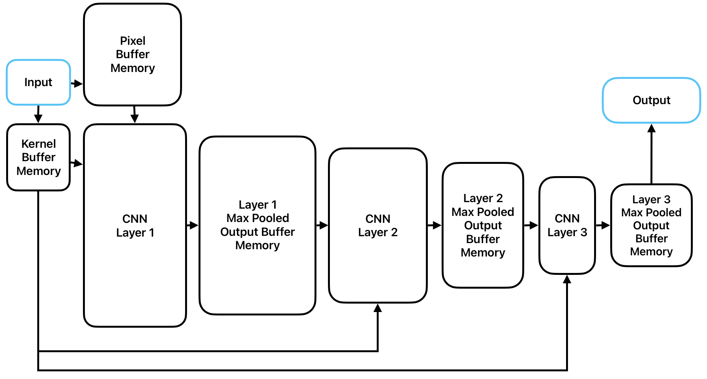
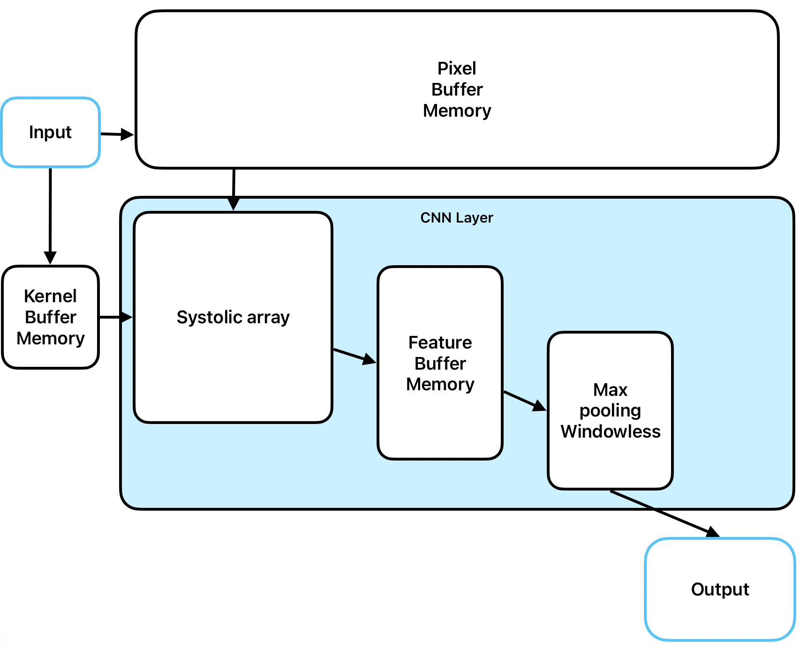
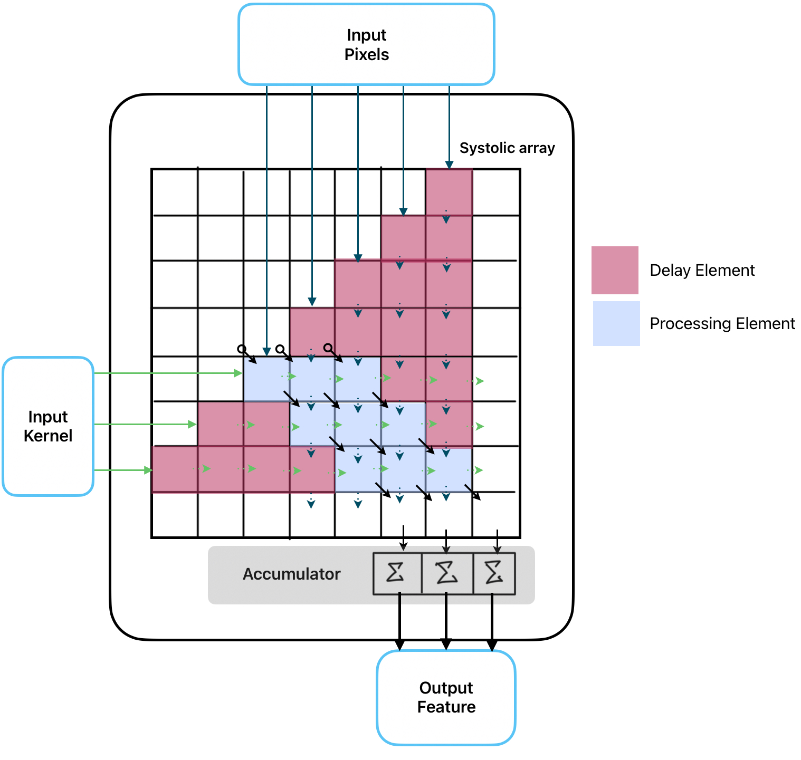
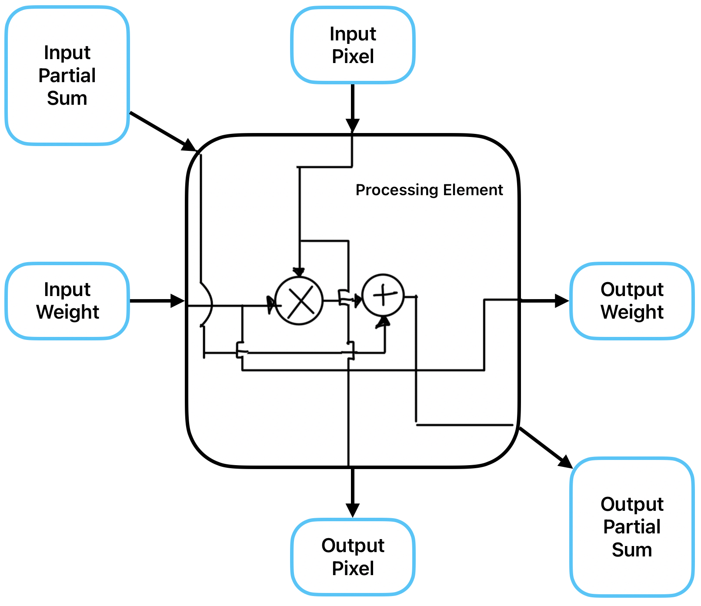
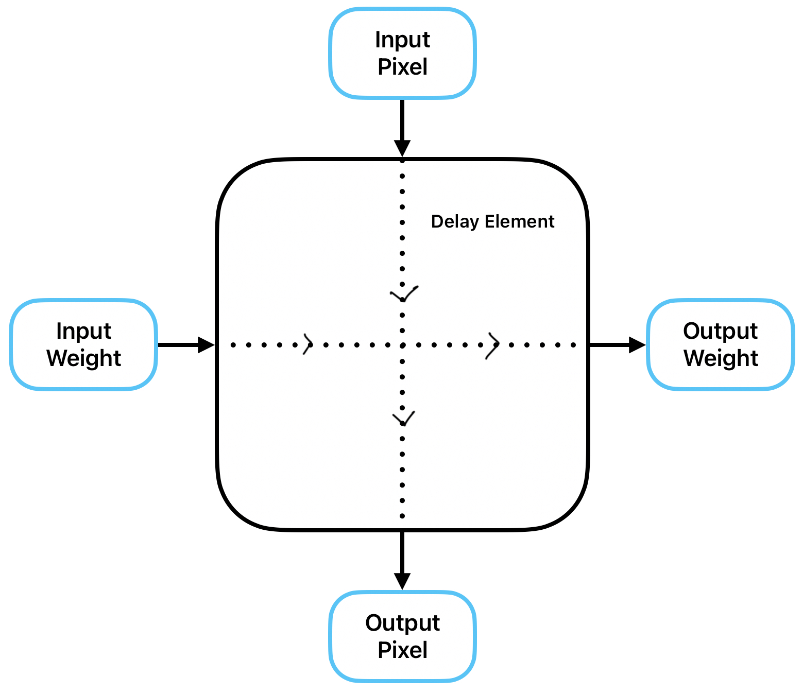
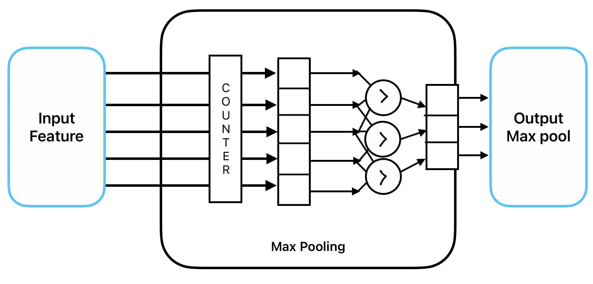

# Modular and Parameterized CNN Accelerator with Systolic Convolution Arrays and Windowless Continuous Parallel Max-Pooling

The aim of this project is to optimize the CNN network to the hardware level, facilitating data reuse, parallel processing, efficient data flow, reduction in ports and IO load for real world use. Also, to make the system truly modular.

Layer can be made modular so we are not limited to pre-defined number of layers, so at the final synthesis/application stage, we can test the proposed CNN model out considering system constraints, etc., by simply arranging the modular layers.

### Systolic array:
Systolic arrays are suitable for data reuse, and parallel process data, eliminates buffer memory for sliding window naive methods.

ReLU can be implemented as a simple comparator logic at the end of the accumulator logic inside systolic array module.

### Processing and delay element:

  
  

Systolic arrays operate rhythmically, where data is continuously flowing, responding to the clock cycle and is synchronized. The version presented above is tailored for convolution, where the inputs should be staggered. If there exists an input element matrix of _n rows_ and _m columns_, and a kernel element matrix of _u rows_ and _v columns_, the systolic array shall be of dimension _n x u_.

### Windowless Max Pooling:

As for Max pooling, instead of sliding windows with stride, we parallel process it using the mentioned methods further in the main document.

For windowless operation, we just take “POOL_SIZE” amount of columns streamed one column at a time, compare them every cycle, along with appropriate STRIDE taken, and determine the maximum value in the pool size. And after POOL_SIZE amount of columns are over, we output/write it to max pool buffer, and continue till end.  
The windowless operation is totally based on counters and control logic.

It gets more effective with increase in size.

### Small sample Systolic array RTL elaboration:
Even a small systolic array has complex control logic involving muxes, and flags, counters.

## Simulation Waveforms for Proof of concept:

### Single Layer CNN system:

### 3 Layer CNN system:

### Max Pooling Module:

### Systolic array module:

For further details [click here](/cnnsystolic- doc PDF.pdf).
